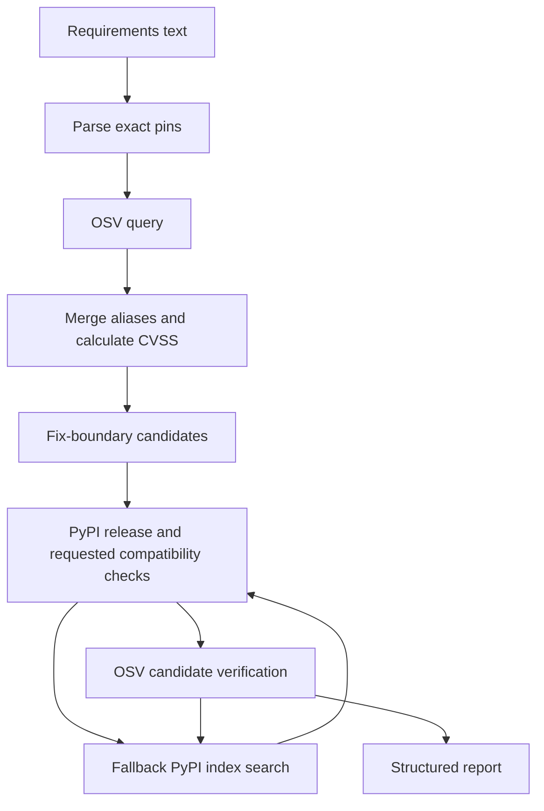

# AI Secure Software Advisor

A Python dependency security scanner that reports known vulnerabilities and
finds upgrade candidates verified against OSV, PyPI metadata and target wheel tags.

**Current scope:** a FastAPI backend MVP. AI-generated explanations, a web
frontend and persistence are planned; they are not implemented.

[](https://github.com/Jason980102/ai-secure-software-advisor/actions/workflows/backend-tests.yml)

## What it does

- Scans an entire pinned Python requirements input in one request.
- Queries OSV, follows pagination and merges records sharing CVE/GHSA/PYSEC aliases.
- Calculates CVSS v2/v3/v4 scores and collects package-specific fix boundaries.
- Checks candidate releases for non-yanked PyPI files, Python requirements and wheel compatibility.
- Searches additional stable PyPI releases when fix-boundary candidates fail.
- Re-queries OSV before returning an upgrade candidate.
- Returns structured findings and an auditable candidate-check history.

102 offline tests pass locally. GitHub CI runs Python 3.11 and 3.12 on Ubuntu 24.04.

The first scanner MVP has been merged into `main`, and its CI passed.
Optional direct-constraint checks are the next feature; commit and merge them through a PR.

## Quick start

Python 3.11 or 3.12 is recommended (the versions covered by CI).
Run commands from the repository root. Live scans need access to OSV and PyPI;
no API keys or database are required.

### Windows PowerShell

```powershell
py -3.12 -m venv .venv-mvp
.\.venv-mvp\Scripts\python.exe -m pip install -r backend\requirements.txt
.\.venv-mvp\Scripts\python.exe -m uvicorn app.main:app --app-dir backend --reload
```

If Python 3.12 is not installed, use `py -3.11`. If your environment already
works, skip environment creation. The `.venv-mvp` directory is ignored by Git.

### Linux / macOS (backend development)

```bash
python3 -m venv .venv
.venv/bin/python -m pip install -r backend/requirements.txt
.venv/bin/python -m uvicorn app.main:app --app-dir backend --reload
```

Open [Swagger UI](http://127.0.0.1:8000/docs). The root URL `/` has no route and
returns 404. The health endpoint is [GET /health](http://127.0.0.1:8000/health).

## Run a scan

In Swagger UI select **POST /api/v1/scan**, click **Try it out**, paste
[examples/scan-request.json](examples/scan-request.json), and click **Execute**:

```json
{
  "requirements": "requests==2.19.0\nflask==2.0.0\nnumpy==1.21.0",
  "target_python": "3.12.0",
  "target_platform": "win_amd64"
}
```

These deliberately old dependency versions are scan inputs; do not install
`examples/requirements-vulnerable.txt` as the scanner's dependencies.

In a second PowerShell terminal:

```powershell
$body = Get-Content -Raw examples\scan-request.json
$report = Invoke-RestMethod -Method Post -Uri http://127.0.0.1:8000/api/v1/scan -ContentType 'application/json' -Body $body
$report | ConvertTo-Json -Depth 20
```

Or with curl on Linux/macOS:

```bash
curl -X POST http://127.0.0.1:8000/api/v1/scan \
  -H 'Content-Type: application/json' \
  --data-binary @examples/scan-request.json
```

## Example result

[examples/scan-report.snapshot.json](examples/scan-report.snapshot.json) is a
saved live result, not a promise of future counts or recommended versions.
OSV and PyPI data change. Its original input had three vulnerable packages and
eight package findings:

| Package | Input version | Findings | Upgrade candidate | How selected |
|---|---|---:|---|---|
| requests | 2.19.0 | 5 | 2.33.0 | Fix boundary |
| flask | 2.0.0 | 2 | 3.1.3 | Fix boundary; major version change |
| numpy | 1.21.0 | 1 | 1.26.0 | Expanded PyPI search |

NumPy 1.22 was rejected because it had no matching CPython 3.12 / Windows x64
wheel. The expanded search found 1.26.0, checked its release again, and queried OSV.

## API contract

| Endpoint | Purpose |
|---|---|
| `GET /health` | Process health; does not test upstream availability |
| `POST /api/v1/scan` | Complete batch scan; input field is `requirements` |
| `POST /api/v1/scan/parse` | Legacy parser; input field is `content`, unsupported lines are skipped |
| `GET /api/v1/scan/vulnerabilities/{package_name}/{version}` | Existing single-package lookup |

Batch input accepts blank lines, comments, inline comments, extras and exact
`==` pins. Package names and versions are normalized; identical pins are merged.
Ranges, wildcards, markers, URLs, hashes, include files and conflicting pins are
rejected. Extras do not trigger extra/transitive dependency discovery.

Limits: 100 unique packages and 100,000 input characters. `target_python` is
optional and must be a full Python 3 version such as `3.12.0`. `target_platform`
requires it and supports:

| Target | Meaning |
|---|---|
| `win_amd64` | Windows x64 |
| `win_arm64` | Windows ARM64 |
| `manylinux_2_17_x86_64` | Linux x64, glibc 2.17 target |
| `manylinux_2_17_aarch64` | Linux ARM64, glibc 2.17 target |

Linux targets do not describe Alpine/musl. Wheel checking assumes conventional
CPython, not PyPy or free-threaded CPython. Omitting target fields skips those
checks; the backend's environment is never assumed to be the scan target.

### Reading the report

- `total_packages`: unique normalized input packages.
- `vulnerable_packages`: input packages with findings.
- `total_vulnerabilities`: deduplicated findings summed per package. A CVE
  affecting two input packages counts twice. These counts describe the input,
  not the upgrade candidates.
- Findings include canonical ID, aliases, summary, severity, CVSS evidence and
  `fixed_versions`. Highest valid CVSS base score is used, with database labels
  as fallback; absent evidence is `UNKNOWN`. Scores are not a project risk score.
- `candidate_source`: `fix_boundary` or `pypi_release`.
- `expanded_search`: whether the fallback index search was attempted.
- `release_checks`: availability, Python/wheel checks and matching filenames.
- `remaining_vulnerability_ids`: `null` means no successful OSV check for that
  candidate; `[]` means OSV returned no findings; IDs explain a rejected candidate.

| Recommendation status | Meaning |
|---|---|
| `not_needed` | No known findings for the input version |
| `candidate` | Requested checks passed; a candidate is available |
| `manual_review` | Missing fix data or no candidate passed within the budget |
| `verification_failed` | Candidate verification/search failed; original findings remain |

Batch input errors return 422. Failure scanning an installed version returns
502. Candidate lookup failures return a report with `verification_failed`.

## How it works



Fix-boundary candidates are tried first. When they fail and budget remains,
the PyPI JSON Simple Index is searched once. Stable eligible releases are tried
in ascending version order; duplicate versions are skipped. Both phases share
five candidate verifications per package. Index prefiltering does not consume
that budget. Every selected release is rechecked before its OSV query.

## Test

PowerShell:

```powershell
$env:PYTHONPATH = 'backend'
.\.venv-mvp\Scripts\python.exe -m pytest backend\tests -q
```

Linux/macOS:

```bash
PYTHONPATH=backend .venv/bin/python -m pytest backend/tests -q
```

Tests mock upstream responses and run offline. They cover parsing, API behavior,
alias merging, pagination/failures, CVSS vectors, release states, wheel tags,
fallback search and the shared candidate budget.

## Repository layout

```text
backend/
  app/api/                 HTTP routes
  app/schemas/             Request and report models
  app/services/            Parsing, OSV, CVSS, PyPI and recommendations
  tests/                   Offline tests
docs/DEMO.zh-TW.md          Five-minute demo guide
examples/                  Request, input and live report snapshot
.github/workflows/          CI
```

## Limitations and next steps

This scanner checks direct pins supplied by the user. It does not resolve a
dependency graph, discover installed packages, download/build distributions,
fully resolve cross-package dependencies or run application tests. Matching wheel tags
and no known OSV findings do not prove a working or fully secure installation.
Missing fix boundaries remain manual review. Exhausting the candidate budget
does not prove no suitable release exists. Scans run sequentially with HTTP
timeouts but no whole-scan deadline.

Next milestones:

1. Expand direct-constraint checks toward transitive dependency resolution.
2. Human-readable remediation summaries; later, grounded AI explanations.
3. Optional interface and scan history after the core checks are reliable.

See the [Chinese demo guide](docs/DEMO.zh-TW.md) for a presentation walkthrough.

## Branch and release workflow

Commit and push changes to `develop`, then confirm its CI. Open a pull request
with base `main` and compare `develop`. Review the full diff and wait for PR CI
before merging. A successful develop run does not mean main has received the MVP.
After merging, confirm main's workflow and test from that branch. No release tag
or public deployment is currently claimed.

## Data sources

- [OSV query API](https://google.github.io/osv.dev/post-v1-query/)
- [OSV schema](https://ossf.github.io/osv-schema/)
- [PyPI JSON API](https://docs.pypi.org/api/json/)
- [PyPI Index API](https://docs.pypi.org/api/index-api/)
- [Packaging tags](https://packaging.pypa.io/en/stable/tags.html)


## Optional direct dependency constraint check

Add `"check_dependencies": true` to the existing scan request. The default is
false, adding no metadata requests. When enabled, the selected plan uses each
accepted candidate version and keeps installed versions for all other packages.
It reads Requires-Dist metadata once per selected package (at most 100 extra
requests, sequential, 10-second timeout each) and compares constraints against
other selected input packages. No dependencies are installed or recursively resolved.

`dependency_check` includes selected_versions, conflict_count, unresolved_count
and per-requirement checks. Report statuses: conflicts_found, incomplete,
no_direct_conflicts. Constraint statuses: satisfied, conflict, missing, unknown,
skipped. Missing means outside the supplied package set, not missing installation.
Unknown metadata/context does not count as success. A metadata error preserves
the vulnerability report and appears as an unknown check. Even no_direct_conflicts
is limited to the supplied pins and available project metadata, not proof of a
complete installable environment. Candidate recommendations remain independent;
conflicts are reported at plan level rather than automatically choosing alternatives.

Python and OS markers use supplied target context; missing context, CPU/OS
release markers, extras and URL dependencies are unresolved. Host defaults are
not used for referenced marker variables. Missing Requires-Dist is conservatively
unknown; an explicit empty list is accepted. PyPI project JSON may not reflect
all wheel-specific dependency metadata. Full resolution is a future milestone.

Example: A requires B<2, but the selected plan has B==2.5 → conflicts_found.
The three-package demo normally reports incomplete because Flask and Requests
depend on additional packages not supplied in that input.
